# Basic Concepts - Part 1

Here are some basic concepts to introduce you to the Apigee Edge API Management Platform.

**Contents**

* What is Apigee Edge?
* The Apigee Edge Management UI
* Orgs, Environments & Platform Users
* Understanding API Proxies, Policies & Flows

# What is Apigee Edge?

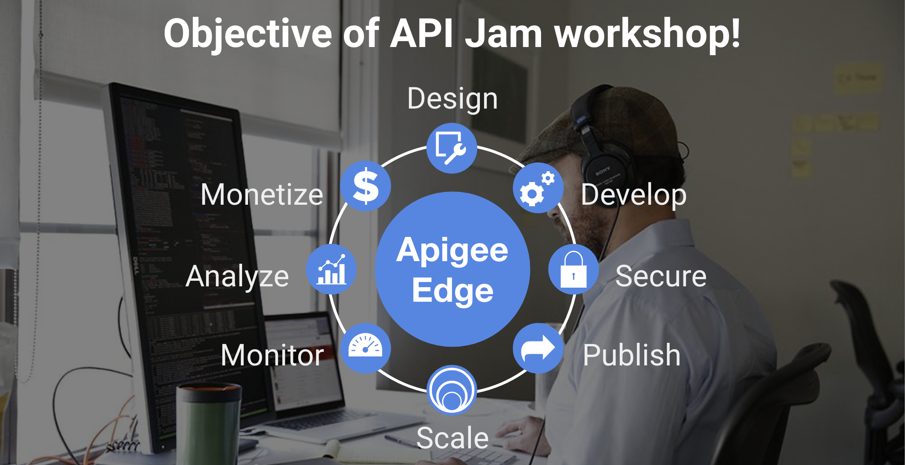]

Here's a brief video to explain what Apigee does:

# The Apigee Edge Management UI

To log into the Apigee Edge API Management Platform, navigate to http://login.apigee.com.

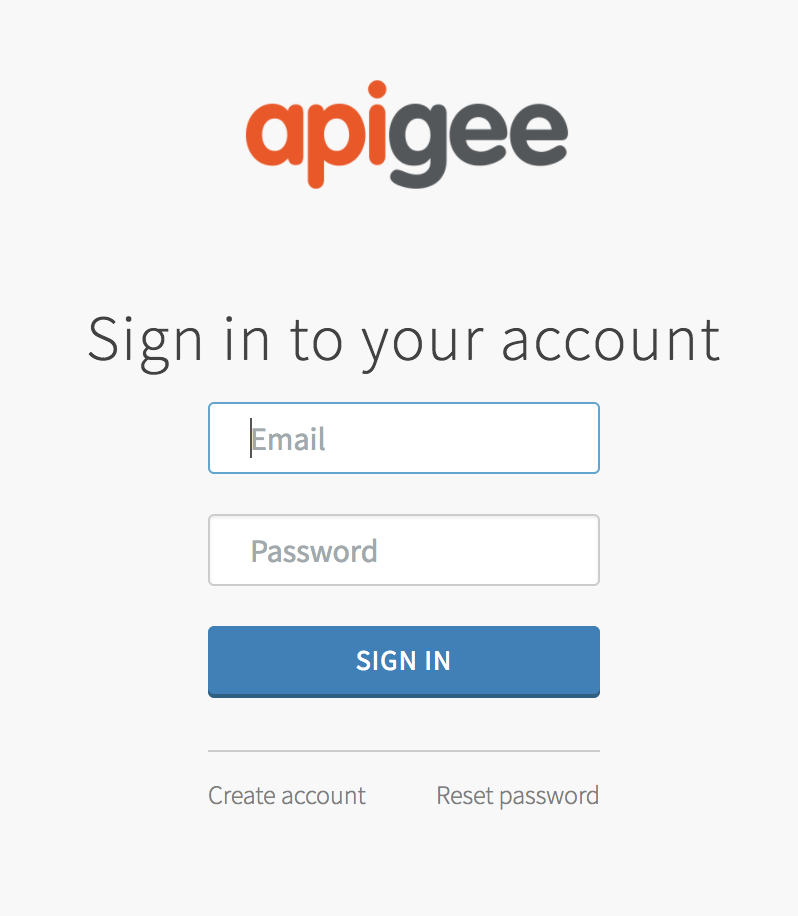]

Once you have logged in, you will have access to the Management UI as shown below:

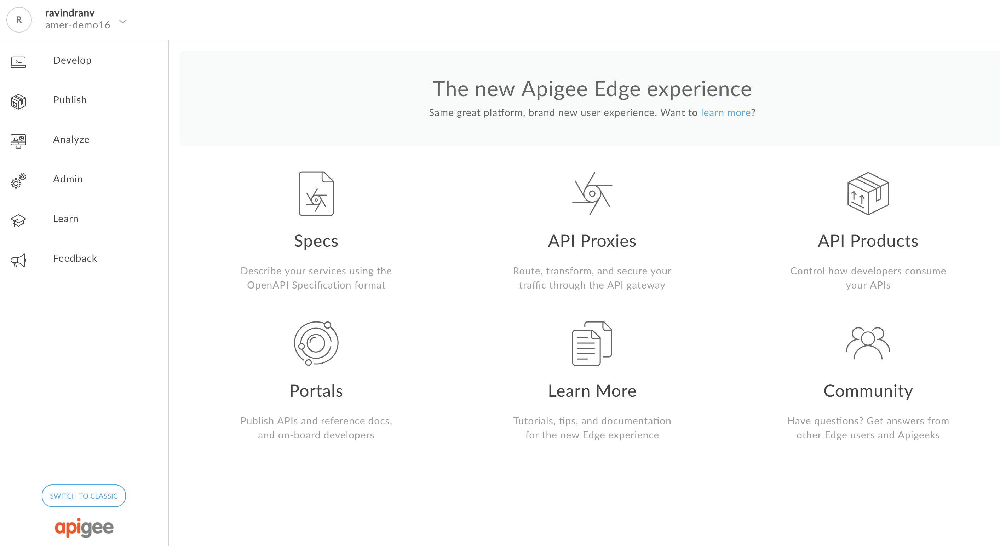]

The Management UI has different sections to access the various Design & Development, Publishing, Monitoring and Administration functions within the platform.

### API Design & Development

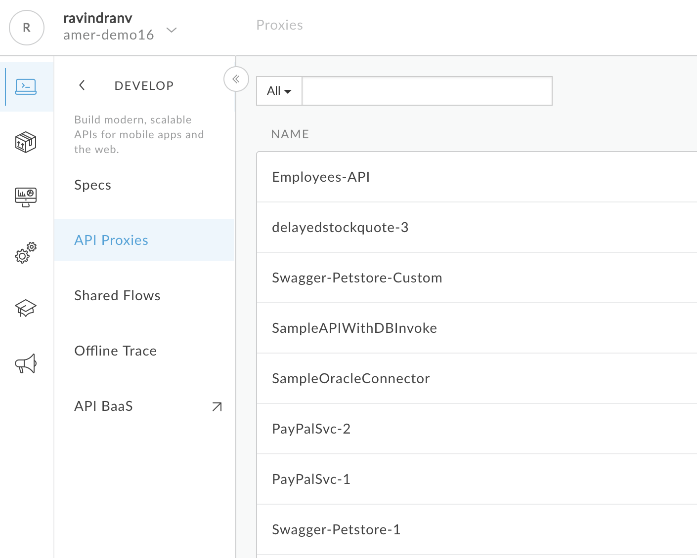]

To access this section, navigate to the ‘Develop’ tab on the left corner of the Management UI. This section provides menus to perform API design and development tasks.

### Publish APIs

]

To access this section, navigate to the ‘Publish’ tab on the left corner of the Management UI. This section provides functionality used to package APIs and publish them for developer consumption, as well as manage the consumers. 

### Anlytics

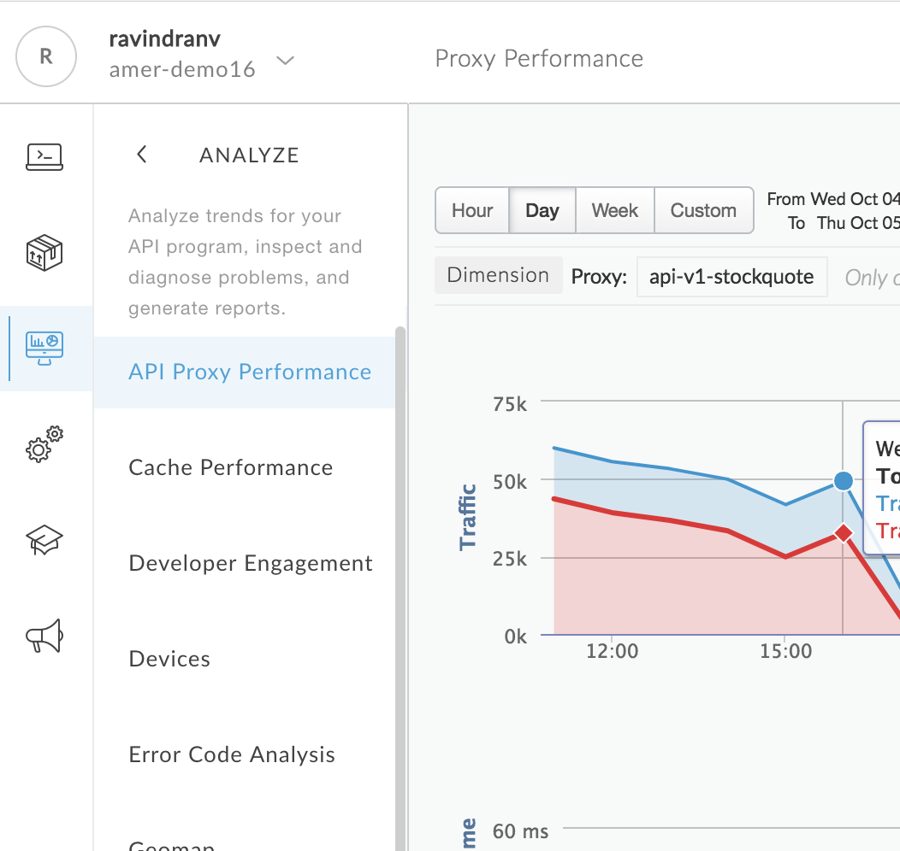]

To access this section, navigate to the ‘Analyze’ tab on the left corner of the Management UI. This section provides access to real-time App and API related analytics dashboards with detailed metrics and drill-downs.

### Organization Administration

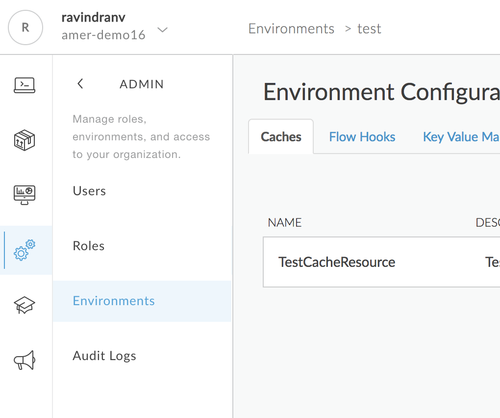]

To access this section, navigate to the ‘Admin’ tab on the left corner of the Management UI. This section provides access to organization administration features such as environment configuration, platform user management and audit log.

### Platform Help

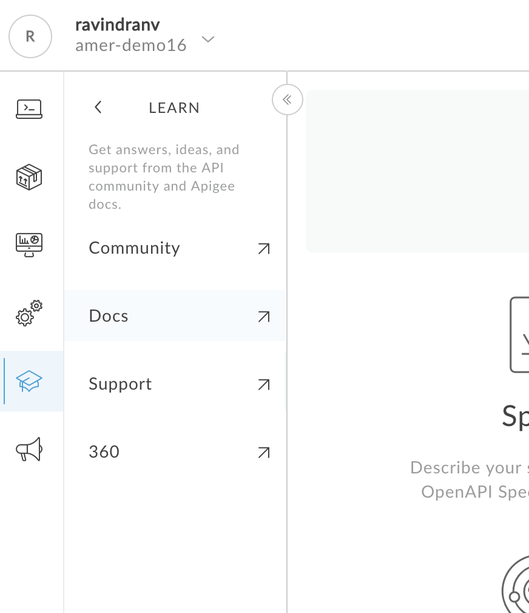]

To access this section, navigate to the ‘Learn’ tab on the left corner of the Management UI. This section provides platform usage help in the form or Docs, Support, Apigee user Community portal, etc.

### What is an Apigee Edge ‘Organization’?

In Apigee Edge, an organization is a container for all the entities managed within the platform, including API proxies, API products, API packages, apps, developers, etc.
A user account is required for access to an organization. Within the Management UI, users can switch context between organizations to which they are a member.
In addition, all users also have access to a ‘Personal Space’, which can be used for API design related operations.

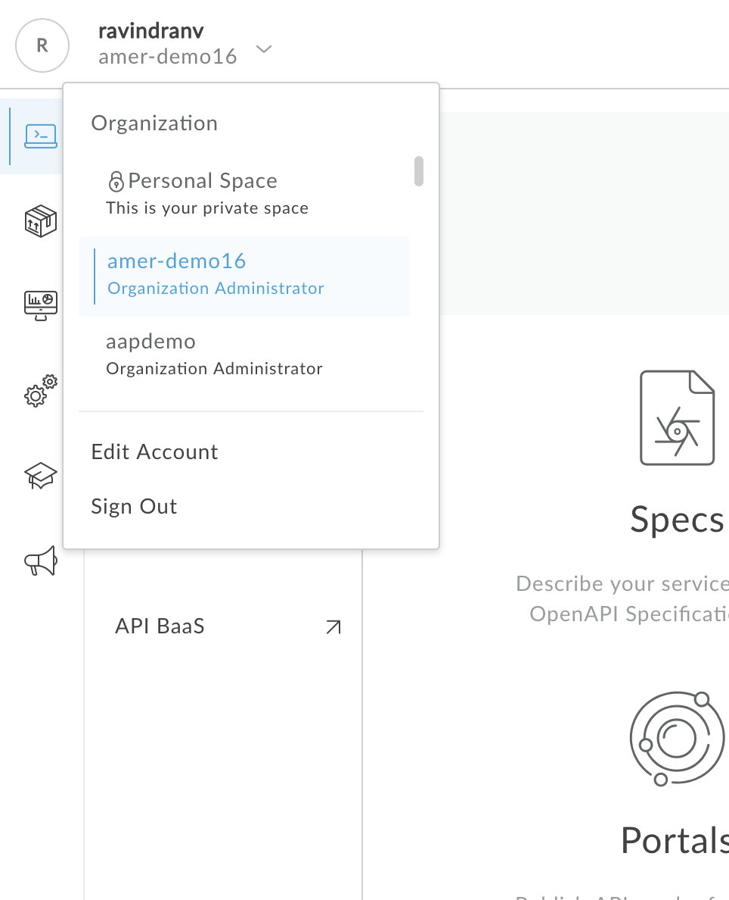]

### What is an Apigee Edge ‘Environment’?

In Apigee Edge, an environment is a runtime execution context for API proxies. An API proxy must be deployed to an environment before the API it exposes is accessible over the network. Apigee customers have the flexibility to set up multiple environments. By default, organizations are provisioned with two environments: 'test' and 'prod'.
The 'test' environment is typically used for deploying API proxies during development.
The 'prod' environment is typically used for promoting API proxies from the test environment after they have been fully developed and tested.

### Understanding API Proxies, Policies & Flows

In Apigee Edge, an API Proxy is a facade for one or more APIs, generic HTTP services, or applications (such as Node.js).
The facade provided by an API proxy decouples the app developer and app client-facing API from the 'backend' functionality invoked for API execution, thereby shielding developers from code changes and enabling innovation at the edge without impacting your internal development teams. As development teams make backend changes, developers continue to call the same interface uninterrupted. Apigee enables you to expose multiple interfaces to the same API, freeing you to customize the signature of an API to meet the needs of various developer niches simultaneously.
An API proxy is implemented as a set of configuration files, policies, and code that rely on a set of resources provided by Apigee Edge. API proxies can be generated and configured using the Apigee Edge management UI, or they can be implemented locally in a text editor or IDE.

[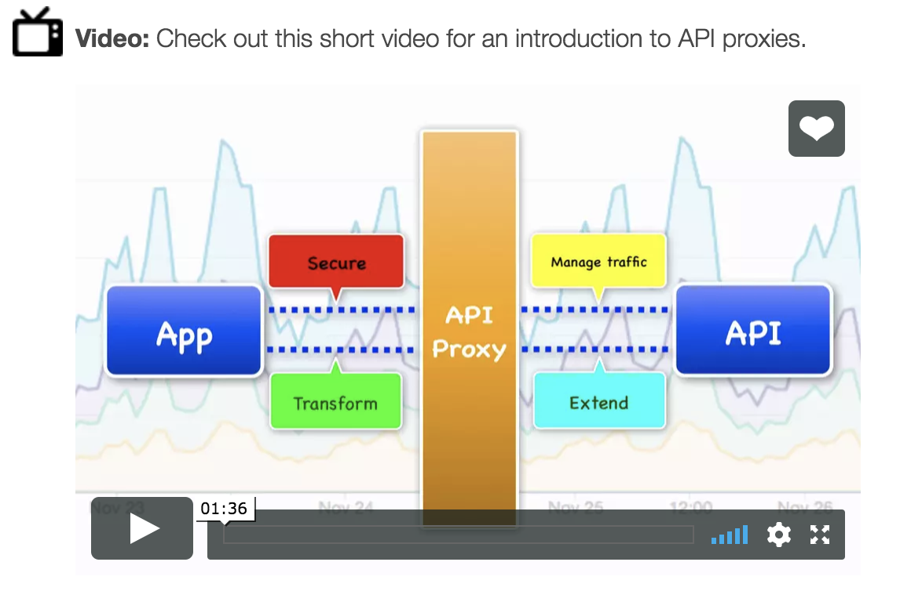](https://vimeo.com/113341767)

**API Policies**

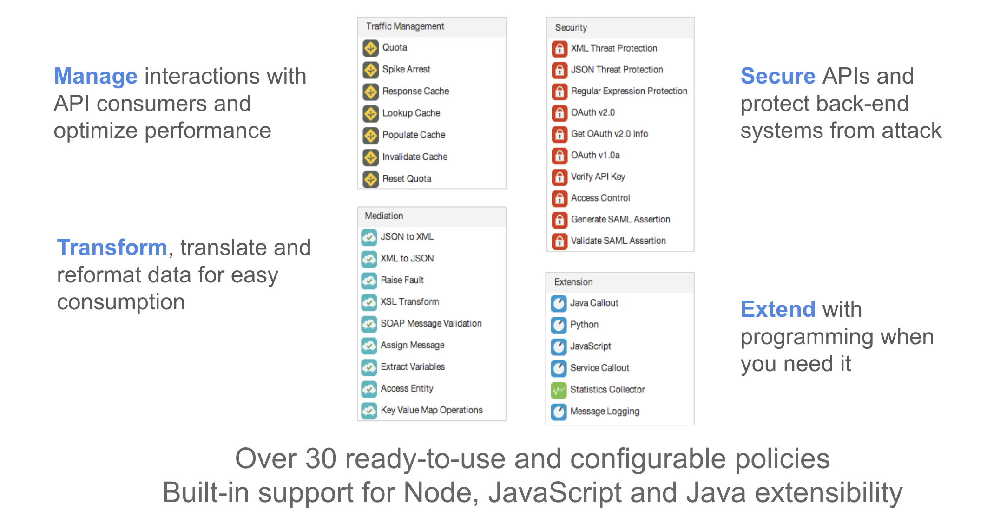]

A policy is a processing step that executes as an atomic, reusable unit of logic within an API proxy processing flow.
Typical policy-based functionality includes transforming message formats, enforcing access control, calling remote services for additional information, masking sensitive data from external users, examining message content for potential threats, caching common responses to improve performance, and so on.
Policies may be conditionally executed based on the content or context of a request or response message. For example, a transformation policy may be executed to customize a response format if the request message was sent from a smartphone.

**Proxy & Target Endpoints**

In an API proxy configuration, there are two types of endpoints: 

]

* **ProxyEndpoint**: Defines the way client apps consume your APIs. You configure the ProxyEndpoint to define the URL of your API proxy. The proxy endpoint also determines whether apps access the API proxy over HTTP or HTTPS. You usually attach policies to the ProxyEndpoint to enforce security, quota checks, and other types of access control and rate-limiting.

* **TargetEndpoint**: Defines the way the API proxy interacts with your backend services. You configure the TargetEndpoint to forward requests to the proper backend service, including defining any security settings, HTTP or HTTPS protocol, and other connection information. You can attach policies to the TargetEndpoint to ensure that response messages are properly formatted for the app that made the initial request.

**Flows**

Any application programming model includes a way to control the flow of processing. In an API proxy, that's done with flows. To flows you add logic, condition statements, error handling, and so on. You use flows to control what happens, and when.
Flows are sequences of policies along the API request processing path. When you add a policuy, such as to verify an API key, you add it as a step in the sequence specified by a flow. When you define a condition to specify whether and when logic executes, you add the condition to a flow.
When deciding where to add logic, you'll first choose whether to add it to a proxy endpoint or target endpoint. An API proxy divides its code between code that interacts with the proxy's client (proxy endpoint) and optional code that interacts with the proxy's backend target, if any (target endpoint).
Both endpoints contain flows, as described here:
]
 
You configure flow with XML that specifies what should happen and in what order. The following illustration shows how flows are ordered sequentially within a proxy endpoint and target endpoint:
]

The proxy endpoint and target endpoint each contain flows that you can arrange in the following sequence:
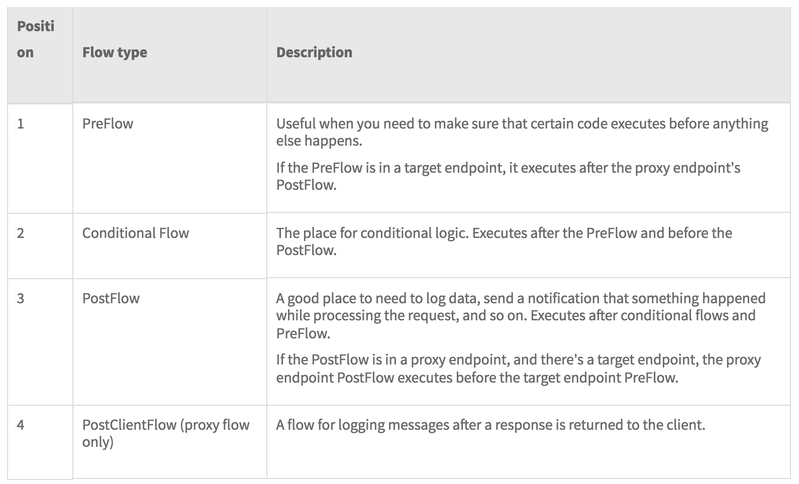]

