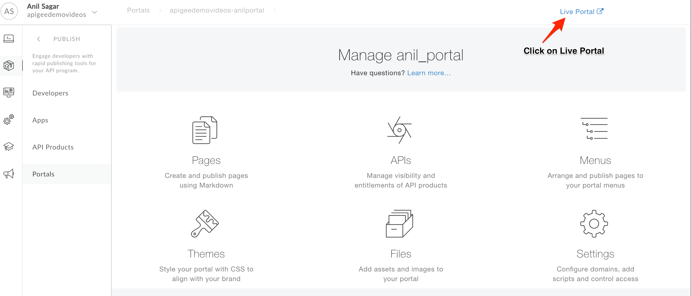
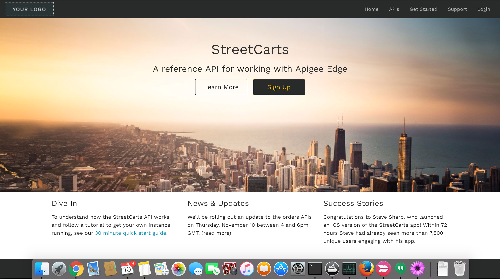
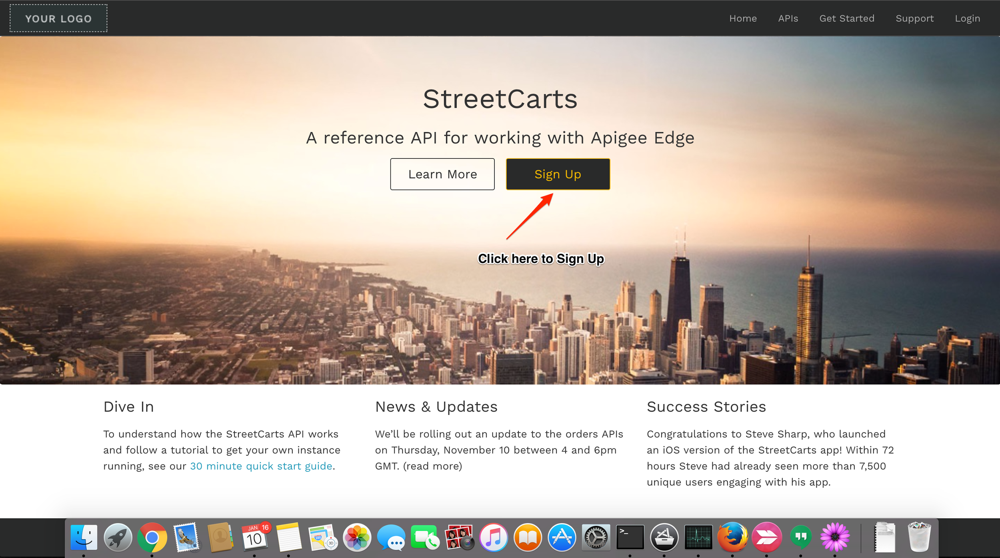
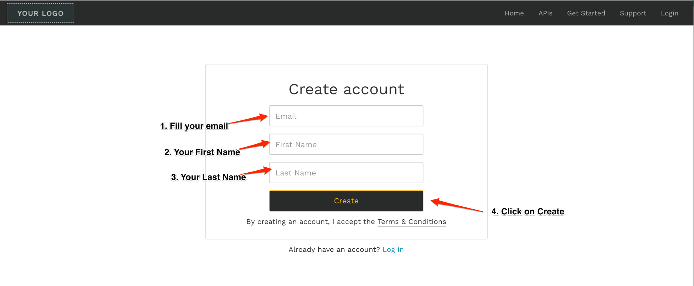
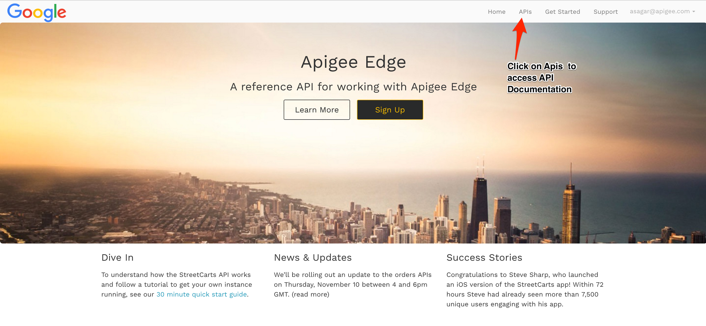
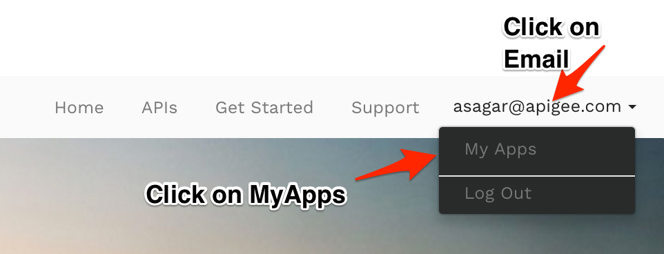
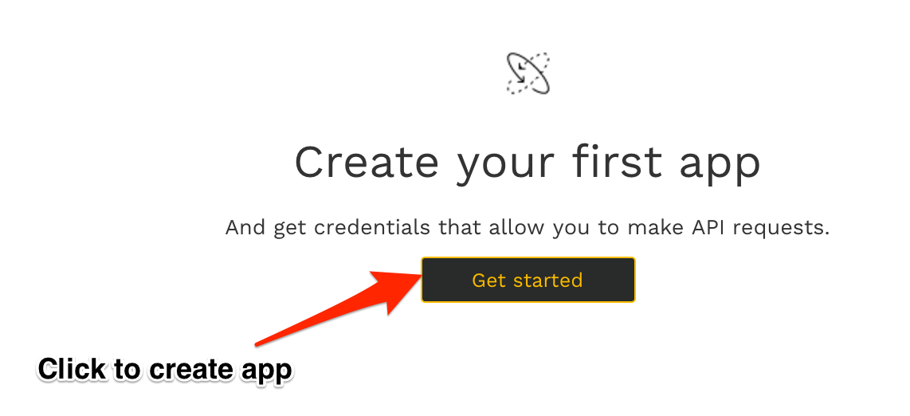
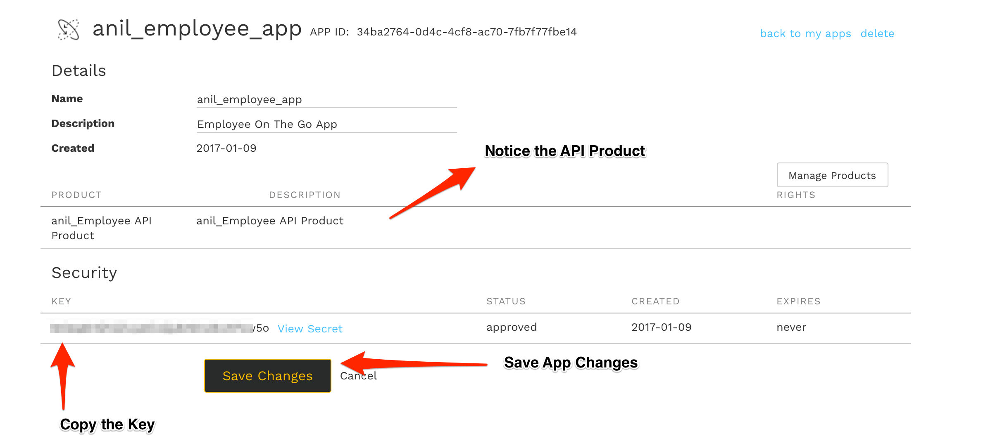

# API Consumption : Developers and Apps 

*Duration : 15 mins*

*Persona : Developer*

# Use case

As an App Developer you would like to learn about APIs exposed by the API Team using API Documentation. Register into an API Program to get access to the APIs exposed by the API Team.

# How can Apigee Edge help?

Apigee Edge has out of the box lightweight Developer Portal which allows API Team to publish API Documentation & as an App Developer you can self register onto API Platform. Once logged in, you can create Apps to get API Keys using which you can access APIs securely.

In this lab, we will see how to register as an App Developer, navigate through API documentation, create app in the Developer Portal to access API keys, test the APIs using the keys we got from Developer Portal.

# Pre-requisites

*API Security* and *API Publishing* lab exercises. 

# Instructions

* Go to [https://apigee.com/edge](https://apigee.com/edge) and log in. This is the Edge management UI. 

* Select **Publish → Portals** in the side navigation menu.


* Click on **{your_initials}_{api_proxy_name}_portal** that you have created in earlier lab exercise.	


* Click on **Live Portal** link to access Developer Portal to start interacting as Developer persona.





* In this lab, we will play the role of App Developer who would like to access the APIs and API Documentation.

* Let’s register as an App Developer by clicking on **Sign Up** link on home page.



* Fill the details, Click on **Create**.



* You will notice a message that says, **Check your Email**. Check your inbox for verification link.


* Click on verification link in your inbox to login in as App Developer into Apigee Developer Portal. Notice your email address in developer portal menu link that indicates that you are logged in.


* Click on **APIs** link in top menu and then click on **{your_initials}_{api_name}_product** category to access API Documentation.




* Go through API Documentation and understand the API Request and Response.


* Let’s **create** a Developer App.

Typically, developers who want to consume APIs go to developer portal and register to use them. When registering, the developer gets to select which of API products he or she wishes to use. For example, some products may be offered for free, while others require payment depending on a service plan. Upon completion, this registration step produces an Edge entity called a **developer app**. A developer app includes the products the developer selected and a set of API keys that the developer will be required to use to access the APIs that are associated with those products. 

* To Create an App, Click on **Email Address** & then **My Apps** in top menu bar.



* Click on **Get Started** to create an App.



* Update App Name & Description. Click on **Create** button to create a new App.


* Click on **{your_intial}-employee-app** to access App Details.


* Let’s add API Product to app before we user API keys, Click on **Manage Products** to add API Product to the App that we have created.


* Choose **{your_initials}_{api_name}**_product & flip **Access** switch to **ON** and then click on **Save** to add API Product to the App.


* Now you have successfully generated API key which can be used to make secured API Calls.



* From the main Apigee UI (not the portal), go back to your Employee API and click the **Trace** tab in the upper right.

* Click **Start Trace Session** to begin a trace session.

* Click **Send** to send a request.  If your API Proxy requires query parameters, add them  prior to sending (Do not add the API Key yet)

   You should see a 401 (unauthorized) response for your API Call because the API Proxy was expecting an API Key as a query      parameter.  See the trace session below

* Now add the query parameter ```?apikey={your_api_key}``` to the URL in the trace tool and try again.  (Replace ```{your_api_key}``` with the API Key you just created in this Lab and resend the request.

   You should see a 2xx response code and the Trace for that request should show that the Verify API Key policy is now            passing.


# Lab Video

If you like to learn by watching, here is a short video on consuming APIs using Apigee Developer Portal [https://youtu.be/nCJwlVF6waw](https://youtu.be/nCJwlVF6waw)

# Earn Extra-points

Now that you have Registered in Developer Portal, Created App, Read API Documentation, Explore more by making an API call using keys generated above.

# Quiz

1. When you create an App, What are the different keys associated with it ?

2. Is it possible to create different Apps with same App Name ?

3. Is it possible to associate multiple API Products with same App ?

# Summary

That completes this hands-on lesson. In this simple lab you learned how to self register as a Developer to access APIs, Create Apps, Access API Keys, and Navigate through API Documentation.

# References

* Useful Apigee documentation links on Apigee Developer Portal.

    * Apigee Developer Portal , [https://docs-new.apigee.com/portal](https://docs-new.apigee.com/portal)

# Rate this lab

How did you like this lab? Rate [here](https://goo.gl/forms/H4qE5nLy36yWjj642).

Now to go [Lab-5](../Lab%205%20Traffic%20Management%20-%20Rate%20Limit%20APIs/README.md)


